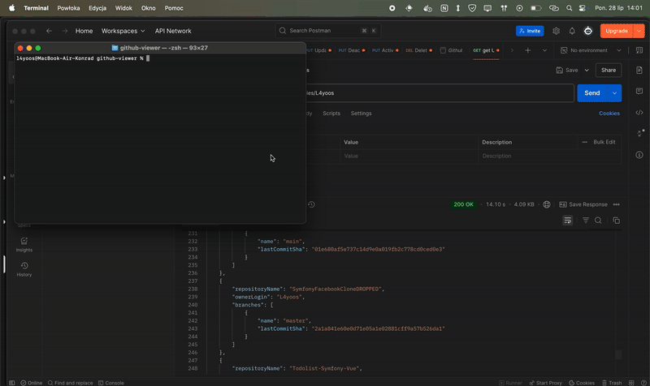

<h1 align="left">github-repo-viewer 📁</h1>

A Spring Boot application for viewing GitHub repositories.

  
  
  

<h2 align="left" id="overview">🚀 Overview</h2>

This project is a GitHub repository viewer built using Spring Boot.

<ul align="left">
  <li>It uses the GitHub API to fetch repository data.</li>
  <li>The application is built with a layered architecture.</li>
</ul>

<h2 align="left" id="built-with">📦 Built With</h2>

This project is built using the following core technologies, frameworks, libraries, and CI/CD tools and configurations:

  
  
  

<h2 align="left" id="table-of-contents">📚 Table of Contents</h2>

This README is organized into the following sections:

<ul align="left">
  <li><a href="#overview">Overview</a></li>
  <li><a href="#built-with">Built With</a></li>
  <li><a href="#table-of-contents">Table of Contents</a></li>
  <li><a href="#architecture">Architecture</a></li>
  <li><a href="#prerequisites">Prerequisites</a></li>
  <li><a href="#installation">Installation</a></li>
  <li><a href="#usage">Usage</a></li>
  <li><a href="#testing">Testing</a></li>
  <li><a href="#demo">Demo</a></li>
</ul>

<h2 align="left" id="architecture">🏗️ Architecture</h2>

This project follows a layered architecture, with separate layers for the presentation, business logic, and data access.

<h2 align="left" id="prerequisites">✅ Prerequisites</h2>

To run this project, you need to have the following prerequisites installed:

<ul align="left">
  <li>Java 21</li>
  <li>Maven 3.x</li>
</ul>

<h2 align="left" id="installation">🛠️ Installation</h2>

To install the project, follow these steps:

<ul align="left">
  <li>Clone the repository using Git.</li>
  <li>Run `mvn clean package` to build the project.</li>
</ul>

<h2 align="left" id="usage">🚀 Usage</h2>

To use the GitHub repository viewer, follow these steps:

<ul align="left">
<li>
1.  <b>Clone the repository:</b>
<pre><code class="language-bash">git clone https://github.com/l4yoos/Github-repo-viewer/
cd github-repo-lister</code></pre>
</li>
<li>
2.  <b>Build the project:</b>
<pre><code class="language-bash">mvn clean install</code></pre>
</li>
<li>
3.  <b>Run the application:</b>
<pre><code class="language-bash">mvn spring-boot:run</code></pre>
The application will start on <code>http://localhost:1234</code>.
</li>
<li>
4.  <b>GitHub API Rate Limits:</b>

By default, unauthenticated requests to the GitHub API have a lower rate limit (e.g., 60 requests per hour per IP address). To increase this limit (e.g., to 5000 requests per hour), you should use a Personal Access Token (PAT).

To configure your PAT:

<ol>
<li>Generate a <a href="https://docs.github.com/en/authentication/keeping-your-account-and-data-secure/managing-your-personal-access-tokens" target="_blank">Personal Access Token (PAT)</a> on GitHub. You typically only need <code>public_repo</code> scope for public data.</li>
<li>Add the token to your <code>src/main/resources/application.properties</code> file:
<pre><code class="language-properties">github.api.token=YOUR_PERSONAL_ACCESS_TOKEN_HERE</code></pre>

<strong>Important:</strong> Do not commit your personal access token to a public repository!

</li>
</ol>
</li>
</ul>

<h2 align="left" id="testing">🚀 Postman</h2>

    <a href="https://www.postman.com/l4yoosek/github-repo-viewer/collection/kuaho0g/github-repo-viewer?share=true"> Collection with API</a>

<h2 align="left" id="testing">🧪 Testing</h2>

This project contains test files for unit testing and integration testing.

<h2 align="left" id="demo">🎬 Demo</h2>

  

